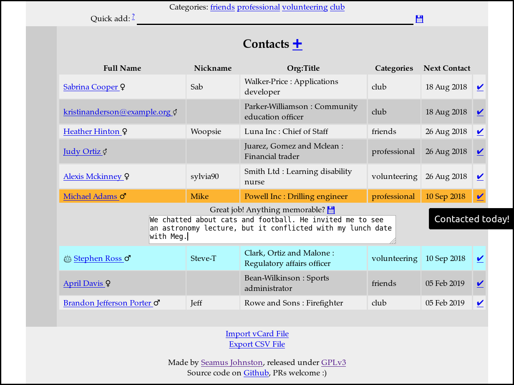
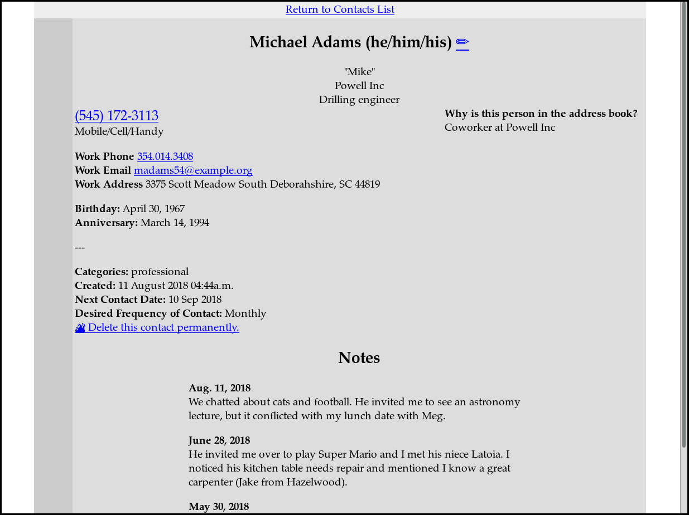

## Relationship Diary

The people we meet are more than telephone numbers or job titles. This software isn't meant to replace your address book. Instead,

* it reminds you when to contact people
* it keeps a diary of your interactions
* it highlights when people have birthdays or anniversaries
* it is self-hosted and free to use
* it is 100% private -- nobody sees your contacts but you

[There is a live demo here.](http://diary.seamusjohnston.com/)

I was motivated to build this by the lack of any FREE relationship management software that DOESN'T share your data with advertisers.

### Installation

This installation guide assumes you are using Ubuntu Linux and that you have never used Python before.

If you are on Mac or Windows, it is likely that you can get it working, but you may need to research how to install Python 3 and Django.

**Note:** Relationship Diary currently has no login feature to protect your data. Therefore, it is strongly recommended that you run it only on your own computer. If someone likes the software enough to request an auth module, I will add one and then you would be able to host it on any computer, including an internet connected server (for example using Dreamhost or Linode).

1. Install Python: `sudo apt install python3`

  This will also install **pip** in Ubuntu, which you need to install the other python packages.
1. Install virtualenv and virtualenvwrapper: `pip3 install virtualenv virtualenvwrapper`

  This is optional, but highly recommended. It allows you to install python packages into a custom directory where they can be easily deleted later without messing up your system install of Python (which a lot of necessary system software relies on).
1. Set up virtualenvwrapper:

        $ export WORKON_HOME=~/Envs
        $ mkdir -p $WORKON_HOME
        $ source /usr/local/bin/virtualenvwrapper.sh
        $ mkvirtualenv crm
1. Get the source code. If you have git: `cd ~; git clone https://github.com/SSPJ/relationship-diary`. If not: `curl -LO https://github.com/SSPJ/relationship-diary/archive/master.zip; unzip master.zip`.

1. Change to the source code directory: `cd relationship-diary`

1. Install Django and other needed python packages: `pip install -r requirements.txt`

### Usage

    $ cd relationship-diary
    $ workon crm
    $ python manage.py runserver 8080

You should see:

    Django version 2.0.7, using settings 'whenandwho.settings'
    Starting development server at http://127.0.0.1:8080/
    Quit the server with CONTROL-C.

Open [http://127.0.0.1:8080](http://127.0.0.1:8080) in your web browser. Tada!

### Backup or Export

All of your data is stored in a sqlite3 database in `relationship-diary/db.sqlite3`. Backup this file to keep it safe.

If you want to convert it to CSV for import into, say, Excel:

    $ cd relationship-diary
    $ sqlite3 -header -csv db.sqlite3 "select * from whenandwho_category;" > "categories-$(date).csv"
    $ sqlite3 -header -csv db.sqlite3 "select * from whenandwho_note;" > "notes-$(date).csv"
    $ sqlite3 -header -csv db.sqlite3 "select * from whenandwho_record;" > "contacts-$(date).csv"

### Uninstall

Consider opening an issue if you encountered bugs or Relationship Diary was missing an important feature.

1. Delete the source directory: `rm -rf relationship-diary` (this will ERASE your data)
1. Delete the virtualenv: `rmvirtualenv crm`
